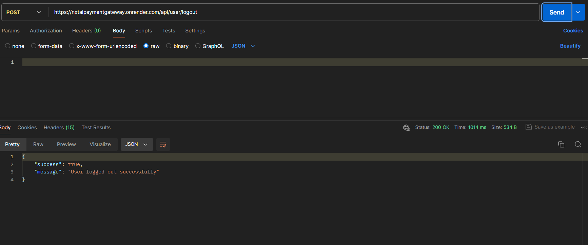

# Payment Gateway Service

This is a scalable and secure payment gateway service built using Node.js and MongoDB. The service handles various types of transactions including credit card, debit card, and digital wallets. It provides endpoints for creating payments, processing payments, retrieving payment statuses, and handling refunds. Swagger is integrated for API documentation.

### Data Flow and Interaction

1. **Authenticated Client** sends a request to create a payment.
2. **Payment Service** processes the request and stores the payment data in **MongoDB**.
3. **Payment Processor** handles the payment processing logic.
4. **Status Service** retrieves the payment status from the database.
5. **Refund Service** processes refund requests.

## Database Schema

### Payment Collection

- User Schema  
{  
  "userEmail": "string",  
  "amount": "number",  
  "currency": "string",  
  "paymentMethod": "string",  
  "status": "string",  
  "createdAt": "date",  
  "updatedAt": "date"  
} 

# Endpoints 

### POST /api/user/register: Create an account (Required fields-  name, email, password, phoneNumber)  
    
### POST /api/user/login: Login your accound (Required fields- email, password)  
    
### POST /api/user/logout: Logout your account (Required token while login your account)  
    
### POST /api/payment: Create a payment (Required token and fields - email, amount, currency, paymentMethod)  
    
### POST /api/payment/:id/process: Process a payment (Required token and paymentId)  
    
### GET /api/payment/:id/status: Retrieve payment status (Required token and paymentId)  
    
### POST /api/payment/:id/refund: Handle a refund (Required token and paymentId)  
    

# Developed by [Aadarsh Raj](https://www.linkedin.com/in/aadarsh-raj-80b862216/)